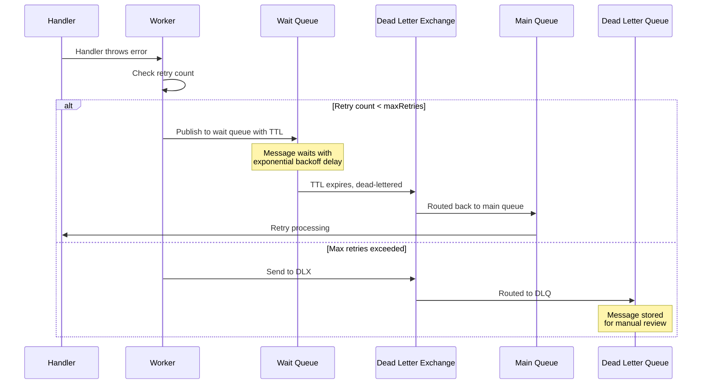

# Resilient Message Handling with Automatic Retry Strategy

Building reliable message-driven applications means dealing with the inevitable: failures happen. Network timeouts, rate limits, temporary service outages — these transient issues shouldn't cause permanent message loss. Today, we're excited to announce a powerful new feature in **amqp-contract**: automatic retry with exponential backoff.

## The Challenge of Message Failure

In any distributed system using message queues, you'll encounter various types of failures:

```typescript
// ❌ Without proper retry handling
const worker = await TypedAmqpWorker.create({
  contract,
  handlers: {
    processOrder: async ({ payload }) => {
      // What happens when the payment service is temporarily down?
      await paymentService.charge(payload);
      // Message is lost or immediately requeued in a tight loop
    },
  },
  urls: ["amqp://localhost"],
});
```

Common problems with naive retry approaches:

1. **Tight retry loops** - Failed messages are immediately reprocessed, overwhelming already-stressed services
2. **No backoff** - No time given for services to recover
3. **Infinite retries** - Messages stuck forever without reaching a dead letter queue
4. **Thundering herd** - All retried messages hit the system simultaneously
5. **Lost context** - No tracking of how many times a message has been retried

## Enter Automatic Retry with Exponential Backoff

amqp-contract now provides a built-in retry mechanism that solves all these problems using RabbitMQ's native TTL (Time To Live) and Dead Letter Exchange (DLX) pattern. Retry is enabled by default for all consumers with sensible defaults.

### Per-Consumer Configuration

Configure retry options per consumer using the handler tuple syntax:

```typescript
import { TypedAmqpWorker, RetryableError } from "@amqp-contract/worker";
import { Future } from "@swan-io/boxed";
import { contract } from "./contract";

const worker = await TypedAmqpWorker.create({
  contract,
  handlers: {
    processOrder: [
      ({ payload }) =>
        // If this fails, message is automatically retried with exponential backoff
        Future.fromPromise(paymentService.charge(payload))
          .mapOk(() => undefined)
          .mapError((error) => new RetryableError("Payment failed", error)),
      {
        retry: {
          maxRetries: 3, // Maximum retry attempts (default: 3)
          initialDelayMs: 1000, // Start with 1 second delay (default: 1000)
          maxDelayMs: 30000, // Cap at 30 seconds (default: 30000)
          backoffMultiplier: 2, // Double the delay each time (default: 2)
          jitter: true, // Add randomness to prevent thundering herd (default: true)
        },
      },
    ],
  },
  urls: ["amqp://localhost"],
}).resultToPromise();
```

## Choosing a Retry Strategy

amqp-contract provides two retry modes to handle different requirements:

### TTL-Backoff Mode (Default)

The default mode uses TTL (Time To Live) + wait queue pattern for **exponential backoff**:

```typescript
{
  retry: {
    mode: "ttl-backoff", // This is the default
    maxRetries: 3,
    initialDelayMs: 1000,
    maxDelayMs: 30000,
    backoffMultiplier: 2,
    jitter: true,
  },
}
```

**Best for:**

- When you need configurable delays between retries
- Preventing thundering herd problems
- Giving downstream services time to recover

**Trade-off:** More complex architecture with wait queues, and potential head-of-queue blocking with mixed TTLs.

### Quorum-Native Mode

A simpler mode that leverages RabbitMQ quorum queue's native `x-delivery-limit` feature:

```typescript
import { TypedAmqpWorker, RetryableError } from "@amqp-contract/worker";
import { Future } from "@swan-io/boxed";

// 1. Define queue with deliveryLimit
const ordersQueue = defineQueue("orders", {
  type: "quorum",
  deliveryLimit: 3, // After 3 delivery attempts, dead-letter
  deadLetter: {
    exchange: dlxExchange,
    routingKey: "orders.failed",
  },
});

// 2. Configure worker with quorum-native mode per consumer
const worker = await TypedAmqpWorker.create({
  contract,
  handlers: {
    processOrder: [
      ({ payload }) =>
        Future.fromPromise(paymentService.charge(payload))
          .mapOk(() => undefined)
          .mapError((error) => new RetryableError("Payment failed", error)),
      {
        retry: {
          mode: "quorum-native", // Use quorum queue's native delivery limit
        },
      },
    ],
  },
  urls: ["amqp://localhost"],
}).resultToPromise();
```

**How it works:**

1. When a handler fails, the message is nacked with `requeue=true`
2. RabbitMQ automatically tracks delivery count via `x-delivery-count` header
3. When count exceeds `deliveryLimit`, message is automatically dead-lettered
4. No wait queues or TTL management needed

**Best for:**

- Simpler architecture requirements
- When immediate retries are acceptable
- Avoiding head-of-queue blocking issues

**Trade-off:** No exponential backoff — retries are immediate.

| Feature                | TTL-Backoff                      | Quorum-Native             |
| ---------------------- | -------------------------------- | ------------------------- |
| Retry delays           | Configurable exponential backoff | Immediate                 |
| Architecture           | Wait queues + DLX                | Native RabbitMQ           |
| Head-of-queue blocking | Possible with mixed TTLs         | None                      |
| Delivery tracking      | Custom `x-retry-count` header    | Native `x-delivery-count` |
| Queue type             | Any                              | Quorum only               |

### How TTL-Backoff Works Under the Hood

When a handler throws an error with retry configured, the following sequence occurs:



**Key advantages of this approach:**

1. **Non-blocking** - Messages wait in a separate queue, not blocking the consumer
2. **Native RabbitMQ features** - Uses TTL and DLX, no external dependencies needed
3. **Durable** - Wait queues are persisted like any other RabbitMQ queue
4. **Scalable** - Works across multiple worker instances

### Exponential Backoff in Action

With default settings, retry delays increase exponentially:

| Attempt | Delay   | Total Wait |
| ------- | ------- | ---------- |
| 1       | 1,000ms | 1s         |
| 2       | 2,000ms | 3s         |
| 3       | 4,000ms | 7s         |
| 4 (DLQ) | -       | -          |

With jitter enabled (default), actual delays vary between 50-100% of the calculated value, preventing all retried messages from hitting downstream services simultaneously.

## Setting Up Your Queues for Retry

For retry to work properly, your queues need Dead Letter Exchange (DLX) configuration:

```typescript
import {
  defineContract,
  defineExchange,
  defineQueue,
  defineQueueBinding,
  defineConsumer,
  defineMessage,
} from "@amqp-contract/contract";
import { z } from "zod";

// Define the main exchange
const mainExchange = defineExchange("orders", "topic", { durable: true });

// Define the Dead Letter Exchange
const dlxExchange = defineExchange("orders-dlx", "topic", { durable: true });

// Define the Dead Letter Queue
const dlq = defineQueue("orders-dlq", { durable: true });

// Define your main queue with deadLetter configuration
const ordersQueue = defineQueue("orders", {
  durable: true,
  deadLetter: {
    exchange: dlxExchange,
    routingKey: "orders.failed",
  },
});

// Define message schema
const orderMessage = defineMessage(
  z.object({
    orderId: z.string(),
    customerId: z.string(),
    amount: z.number().positive(),
  }),
);

// Compose the contract
const contract = defineContract({
  exchanges: {
    main: mainExchange,
    dlx: dlxExchange,
  },
  queues: {
    orders: ordersQueue,
    ordersDlq: dlq,
  },
  bindings: {
    mainBinding: defineQueueBinding(ordersQueue, mainExchange, {
      routingKey: "order.#",
    }),
    dlqBinding: defineQueueBinding(dlq, dlxExchange, {
      routingKey: "orders.failed",
    }),
  },
  consumers: {
    processOrder: defineConsumer(ordersQueue, orderMessage),
  },
  publishers: {
    // ... your publishers
  },
});
```

::: warning Queue DLX Required
If a queue doesn't have `deadLetter` configured, the worker will log a warning and fall back to immediate requeue. Always configure DLX on your queues for proper retry functionality.
:::

## Explicit Error Classification

Not all errors should be retried. amqp-contract provides two error classes for explicit control:

### RetryableError - For Transient Failures

Use `RetryableError` when the operation might succeed if retried:

```typescript
import { TypedAmqpWorker, RetryableError } from "@amqp-contract/worker";
import { Future } from "@swan-io/boxed";

const worker = await TypedAmqpWorker.create({
  contract,
  handlers: {
    processOrder: [
      ({ payload }) =>
        Future.fromPromise(externalApiCall(payload))
          .mapOk(() => undefined)
          .mapError(
            (error) =>
              // Explicitly signal this should be retried
              new RetryableError("External API temporarily unavailable", error),
          ),
      {
        retry: {
          maxRetries: 5,
          initialDelayMs: 2000,
        },
      },
    ],
  },
  urls: ["amqp://localhost"],
}).resultToPromise();
```

### NonRetryableError - For Permanent Failures

Use `NonRetryableError` when retrying would be pointless:

```typescript
import { TypedAmqpWorker, NonRetryableError, RetryableError } from "@amqp-contract/worker";
import { Future, Result } from "@swan-io/boxed";

const worker = await TypedAmqpWorker.create({
  contract,
  handlers: {
    processOrder: [
      ({ payload }) => {
        // Validation errors should not be retried
        if (payload.amount <= 0) {
          return Future.value(
            Result.Error(new NonRetryableError("Invalid order amount - cannot be negative")),
          );
        }

        // Business rule violations - check and fail fast
        return Future.fromPromise(isBlacklistedCustomer(payload.customerId))
          .flatMapOk((isBlacklisted) => {
            if (isBlacklisted) {
              return Future.value(Result.Error(new NonRetryableError("Customer is blacklisted")));
            }
            return Future.fromPromise(processPayment(payload))
              .mapOk(() => undefined)
              .mapError((error) => new RetryableError("Payment failed", error));
          })
          .mapError((error) => new RetryableError("Check failed", error));
      },
      {
        retry: {
          maxRetries: 5,
          initialDelayMs: 2000,
        },
      },
    ],
  },
  urls: ["amqp://localhost"],
}).resultToPromise();
```

**NonRetryableError behavior:**

- Message is immediately sent to DLQ (if configured)
- No retry attempts are made
- Perfect for validation errors, business rule violations, or permanent external failures

### Error Type Decision Guide

| Error Type          | Use Case                                            | Behavior                                      |
| ------------------- | --------------------------------------------------- | --------------------------------------------- |
| `RetryableError`    | Transient failures (network, rate limits, timeouts) | Retry with exponential backoff                |
| `NonRetryableError` | Permanent failures (validation, business rules)     | Immediate DLQ                                 |
| Any other error     | Unexpected failures                                 | Retry with backoff (when retry is configured) |

## Safe Handlers for Maximum Control

For the most explicit error handling, use safe handlers that return `Future<Result>`:

```typescript
import { defineHandler, RetryableError, NonRetryableError } from "@amqp-contract/worker";
import { Future, Result } from "@swan-io/boxed";
import { match } from "ts-pattern";

const processOrderHandler = defineHandler(contract, "processOrder", ({ payload }) => {
  // Validation - non-retryable
  if (payload.amount <= 0) {
    return Future.value(Result.Error(new NonRetryableError("Invalid amount")));
  }

  return Future.fromPromise(processPayment(payload))
    .mapOk(() => undefined)
    .mapError((error) =>
      match(error)
        .when(
          (e) => e instanceof PaymentDeclinedError,
          () => new NonRetryableError("Payment declined", error),
        )
        .when(
          (e) => e instanceof RateLimitError,
          () => new RetryableError("Rate limited, will retry", error),
        )
        .otherwise(() => new RetryableError("Unexpected error", error)),
    );
});

const worker = await TypedAmqpWorker.create({
  contract,
  handlers: {
    processOrder: [
      processOrderHandler,
      {
        retry: {
          maxRetries: 5,
          initialDelayMs: 2000,
        },
      },
    ],
  },
  urls: ["amqp://localhost"],
}).resultToPromise();
```

## Retry Header Tracking

The worker automatically adds headers to track retry information:

| Header                      | Description                                   |
| --------------------------- | --------------------------------------------- |
| `x-retry-count`             | Number of times this message has been retried |
| `x-last-error`              | Error message from the last failed attempt    |
| `x-first-failure-timestamp` | Timestamp of the first failure                |

These headers are invaluable for monitoring and debugging failed messages in your DLQ.

## Retry with Batch Processing

Retry works seamlessly with batch processing. If a batch handler fails, all messages in the batch are retried together:

```typescript
import { TypedAmqpWorker, RetryableError } from "@amqp-contract/worker";
import { Future } from "@swan-io/boxed";

const worker = await TypedAmqpWorker.create({
  contract,
  handlers: {
    processOrders: [
      ({ payload: messages }) =>
        // Batch insert to database
        Future.fromPromise(db.orders.insertMany(messages))
          .mapOk(() => undefined)
          .mapError(
            // All messages in batch will be retried together
            (error) => new RetryableError("Batch insert failed", error),
          ),
      {
        batchSize: 10,
        batchTimeout: 1000,
        retry: {
          maxRetries: 3,
          initialDelayMs: 1000,
        },
      },
    ],
  },
  urls: ["amqp://localhost"],
}).resultToPromise();
```

::: warning Batch Retry Behavior
All messages in a failed batch receive the same retry count and delay. For partial batch success handling, consider processing messages individually instead.
:::

## Best Practices for Production

Here are our recommendations for production deployments:

### 1. Configure Appropriate Delays

```typescript
{
  retry: {
    initialDelayMs: 1000,   // 1 second start
    maxDelayMs: 60000,      // 1 minute max
    backoffMultiplier: 2,   // Double each time
  },
}
```

### 2. Always Enable Jitter

Keep jitter enabled (it's the default) to prevent thundering herd:

```typescript
{
  retry: {
    jitter: true, // Spreads retry load (default: true)
  },
}
```

### 3. Set Reasonable Max Retries

3-5 retries is usually sufficient. More than that and you're probably dealing with a permanent issue:

```typescript
{
  retry: {
    maxRetries: 3, // Initial attempt + 3 retries = 4 total attempts (default: 3)
  },
}
```

### 4. Make Handlers Idempotent

Since messages may be processed multiple times, design your handlers to be idempotent:

```typescript
import { Future, Result } from "@swan-io/boxed";
import { RetryableError } from "@amqp-contract/worker";

const processOrderHandler = ({ payload }) => {
  // Use the orderId as an idempotency key
  return Future.fromPromise(db.orders.findById(payload.orderId))
    .flatMapOk((existing) => {
      if (existing) {
        console.log(`Order ${payload.orderId} already processed, skipping`);
        return Future.value(Result.Ok(undefined));
      }
      return Future.fromPromise(db.orders.create(payload)).mapOk(() => undefined);
    })
    .mapError((error) => new RetryableError("Database error", error));
};
```

### 5. Monitor Your DLQ

Set up alerts for messages reaching your dead letter queue:

```typescript
import { Future, Result } from "@swan-io/boxed";

// Example: DLQ monitoring consumer
const dlqMonitor = await TypedAmqpWorker.create({
  contract: dlqContract,
  handlers: {
    monitorFailedOrders: ({ payload }) => {
      // Alert your monitoring system
      return Future.fromPromise(
        alerting.send({
          severity: "warning",
          message: `Order ${payload.orderId} failed after max retries`,
          headers: payload.headers,
        }),
      )
        .mapOk(() => undefined)
        .mapError(() => new Error("Alert failed"));
    },
  },
  urls: ["amqp://localhost"],
});
```

## Per-Consumer Configuration

Retry is now configured per-consumer using the handler tuple syntax. This allows different consumers to have different retry strategies:

### Basic Usage

```typescript
// Simple handler - uses default retry settings
const worker = await TypedAmqpWorker.create({
  contract,
  handlers: { processOrder: handler },
  urls: ["amqp://localhost"],
});
```

### Custom Retry Settings

```typescript
// Handler with custom retry configuration
const worker = await TypedAmqpWorker.create({
  contract,
  handlers: {
    processOrder: [
      handler,
      {
        retry: {
          maxRetries: 5,
          initialDelayMs: 2000,
          maxDelayMs: 60000,
          backoffMultiplier: 2,
          jitter: true,
        },
      },
    ],
  },
  urls: ["amqp://localhost"],
});
```

**Configuration tips:**

- [ ] Add `deadLetter` configuration to your queue definitions
- [ ] Create DLQ exchanges and queues in your contract
- [ ] Customize `retry` options per consumer as needed
- [ ] Consider using `NonRetryableError` for validation failures
- [ ] Set up DLQ monitoring and alerting

## Conclusion

Building resilient message-driven applications requires thoughtful error handling. With amqp-contract's automatic retry mechanism, you get:

- **Exponential backoff** - Gives failing services time to recover
- **Jitter** - Prevents thundering herd problems
- **Explicit error classification** - Control which errors should be retried
- **Header tracking** - Full visibility into retry history
- **Native RabbitMQ patterns** - No external dependencies, just TTL and DLX
- **Type safety** - Full TypeScript support throughout

Stop fighting transient failures. Let amqp-contract handle retries automatically while you focus on your business logic.

## Try It Today

The retry feature is available in @amqp-contract/worker. Check out the [Worker Usage Guide](/guide/worker-usage#error-handling-and-retry) for complete documentation.

```bash
pnpm add @amqp-contract/worker @amqp-contract/contract
```

---

**Links:**

- [Worker Usage Guide - Error Handling and Retry](/guide/worker-usage#error-handling-and-retry)
- [amqp-contract Documentation](https://btravers.github.io/amqp-contract)
- [GitHub Repository](https://github.com/btravers/amqp-contract)

_Have you implemented retry strategies in your AMQP applications? Share your experience in the comments!_
