# AsyncAPI Generation Example

Learn how to generate AsyncAPI 3.0 specifications from your AMQP contracts.

## Overview

This example demonstrates:

- ✅ Generating AsyncAPI 3.0 specifications from contracts
- ✅ Configuring multiple server environments
- ✅ Exporting to JSON and YAML formats
- ✅ Using generated specs with AsyncAPI tools

## What is AsyncAPI?

[AsyncAPI](https://www.asyncapi.com/) is an open-source specification for describing and documenting event-driven APIs. It's like OpenAPI (Swagger) but for asynchronous messaging systems like [RabbitMQ](https://www.rabbitmq.com/), Kafka, and MQTT.

```mermaid
graph LR
    subgraph "Your Code"
        Contract["📋 AMQP Contract<br/>TypeScript + Zod"]
    end

    subgraph "Generation"
        Generator["🔄 AsyncAPI Generator"]
    end

    subgraph "Output"
        JSON["📄 asyncapi.json"]
        YAML["📄 asyncapi.yaml"]
    end

    subgraph "Usage"
        Studio["🎨 AsyncAPI Studio"]
        Docs["📚 HTML Docs"]
        Validate["✅ Validation"]
        CodeGen["⚙️ Code Generation"]
    end

    Contract -->|"generateAsyncAPI"| Generator
    Generator --> JSON
    Generator --> YAML

    JSON --> Studio
    JSON --> Docs
    JSON --> Validate
    JSON --> CodeGen

    YAML --> Studio
    YAML --> Docs

    style Contract fill:#e1f5ff
    style Generator fill:#fff3cd
    style JSON fill:#d4edda
    style YAML fill:#d4edda
    style Studio fill:#f8d7da
    style Docs fill:#f8d7da
    style Validate fill:#f8d7da
    style CodeGen fill:#f8d7da
```



## Running the Example

### Prerequisites

Build the packages:

```bash
pnpm install
pnpm build
```

### Generate Specification

Run the generation script:

```bash
pnpm --filter @amqp-contract-samples/asyncapi-generation generate
```

This creates two files:

- `asyncapi.json` - Full AsyncAPI 3.0.0 specification in JSON
- `asyncapi.yaml` - YAML format

## Example Contract

The sample uses a simple order processing contract:

```typescript
import {
  defineContract,
  defineExchange,
  defineQueue,
  definePublisherFirst,
  defineMessage,
} from "@amqp-contract/contract";
import { z } from "zod";

// Define resources
const ordersExchange = defineExchange("orders", "topic", { durable: true });
const orderProcessingQueue = defineQueue("order-processing", { durable: true });

// Define message schema
const orderMessage = defineMessage(
  z.object({
    orderId: z.string(),
    customerId: z.string(),
    amount: z.number().positive(),
    items: z.array(
      z.object({
        productId: z.string(),
        quantity: z.number().int().positive(),
      }),
    ),
  }),
);

// Publisher-first pattern ensures consistency
const { publisher: orderCreatedPublisher, createConsumer: createOrderCreatedConsumer } =
  definePublisherFirst(ordersExchange, orderMessage, { routingKey: "order.created" });

// Create consumer from event
const { consumer: processOrderConsumer, binding: orderBinding } =
  createOrderCreatedConsumer(orderProcessingQueue);

export const contract = defineContract({
  exchanges: { orders: ordersExchange },
  queues: { orderProcessing: orderProcessingQueue },
  bindings: { orderBinding },
  publishers: {
    orderCreated: orderCreatedPublisher,
  },
  consumers: {
    processOrder: processOrderConsumer,
  },
});
```

## Generation Code

```typescript
import { writeFileSync } from "fs";
import { generateAsyncAPI } from "@amqp-contract/asyncapi";
import { contract } from "./contract";
import YAML from "yaml";

// Generate AsyncAPI specification
const spec = generateAsyncAPI(contract, {
  info: {
    title: "Order Processing API",
    version: "1.0.0",
    description: "Type-safe AMQP messaging API for order processing",
    contact: {
      name: "API Team",
      email: "api@example.com",
    },
    license: {
      name: "MIT",
    },
  },
  servers: {
    production: {
      host: "prod.rabbitmq.com:5671",
      protocol: "amqps",
      description: "Production RabbitMQ server (TLS)",
    },
    staging: {
      host: "staging.rabbitmq.com:5671",
      protocol: "amqps",
      description: "Staging environment (TLS)",
    },
    development: {
      host: "localhost:5672",
      protocol: "amqp",
      description: "Local development server (plaintext, not for production use)",
    },
  },
});

// Export as JSON
writeFileSync("asyncapi.json", JSON.stringify(spec, null, 2));
console.log("✓ Generated asyncapi.json");

// Export as YAML
const yaml = YAML.stringify(spec);
writeFileSync("asyncapi.yaml", yaml);
console.log("✓ Generated asyncapi.yaml");
```

## Generated Specification

### JSON Output

The generated `asyncapi.json` includes:

```json
{
  "asyncapi": "3.0.0",
  "info": {
    "title": "Order Processing API",
    "version": "1.0.0",
    "description": "Type-safe AMQP messaging API for order processing"
  },
  "servers": {
    "production": {
      "host": "prod.rabbitmq.com:5672",
      "protocol": "amqp"
    }
  },
  "channels": {
    "orders": {
      "address": "orders",
      "messages": {
        "orderCreated": {
          "payload": {
            "type": "object",
            "properties": {
              "orderId": { "type": "string" },
              "customerId": { "type": "string" },
              "amount": { "type": "number" },
              "items": {
                "type": "array",
                "items": {
                  "type": "object",
                  "properties": {
                    "productId": { "type": "string" },
                    "quantity": { "type": "integer" }
                  }
                }
              }
            },
            "required": ["orderId", "customerId", "amount", "items"]
          }
        }
      }
    }
  },
  "operations": {
    "publishOrderCreated": {
      "action": "send",
      "channel": { "$ref": "#/channels/orders" }
    },
    "consumeProcessOrder": {
      "action": "receive",
      "channel": { "$ref": "#/channels/order-processing" }
    }
  }
}
```

### YAML Output

The `asyncapi.yaml` provides a more readable format:

```yaml
asyncapi: 3.0.0
info:
  title: Order Processing API
  version: 1.0.0
  description: Type-safe AMQP messaging API for order processing
servers:
  production:
    host: prod.rabbitmq.com:5672
    protocol: amqp
channels:
  orders:
    address: orders
    messages:
      orderCreated:
        payload:
          type: object
          properties:
            orderId:
              type: string
            amount:
              type: number
```

## Using the Generated Specification

### AsyncAPI Studio

View and edit in [AsyncAPI Studio](https://studio.asyncapi.com/):

1. Open [studio.asyncapi.com](https://studio.asyncapi.com/)
2. Click "Import" → "From file"
3. Upload your `asyncapi.json` or `asyncapi.yaml`
4. Explore the interactive documentation

### Generate Documentation

Use AsyncAPI Generator to create HTML documentation:

```bash
# Install AsyncAPI CLI
npm install -g @asyncapi/cli

# Generate HTML docs
asyncapi generate fromFile asyncapi.json @asyncapi/html-template -o docs/

# Open the generated documentation
open docs/index.html
```

### Generate Code

Generate client/server code in various languages:

```bash
# Generate Node.js code
asyncapi generate fromFile asyncapi.json @asyncapi/nodejs-template -o generated/

# Generate Python code
asyncapi generate fromFile asyncapi.json @asyncapi/python-paho-template -o generated/
```

### Validate Specification

Validate your AsyncAPI spec:

```bash
asyncapi validate asyncapi.json
```

## Schema Conversion

amqp-contract automatically converts Zod schemas to JSON Schema:

```mermaid
flowchart LR
    subgraph "Zod Schema Definition"
        ZodDef["z.object({<br/>orderId: z.string(),<br/>amount: z.number()<br/>})"]
    end

    subgraph "Conversion Process"
        Converter["🔄 Schema Converter"]
    end

    subgraph "JSON Schema Output"
        JSONSchema["{<br/>'type': 'object',<br/>'properties': {...},<br/>'required': [...]<br/>}"]
    end

    subgraph "AsyncAPI Spec"
        AsyncAPI["channels:<br/>messages:<br/>payload: {...}"]
    end

    ZodDef -->|"toJsonSchema"| Converter
    Converter --> JSONSchema
    JSONSchema --> AsyncAPI

    style ZodDef fill:#e1f5ff
    style Converter fill:#fff3cd
    style JSONSchema fill:#d4edda
    style AsyncAPI fill:#f8d7da
```



### Zod Types → JSON Schema

| Zod Type          | JSON Schema Type                            |
| ----------------- | ------------------------------------------- |
| `z.string()`      | `{ "type": "string" }`                      |
| `z.number()`      | `{ "type": "number" }`                      |
| `z.boolean()`     | `{ "type": "boolean" }`                     |
| `z.array(T)`      | `{ "type": "array", "items": T }`           |
| `z.object({...})` | `{ "type": "object", "properties": {...} }` |
| `z.enum([...])`   | `{ "enum": [...] }`                         |
| `z.union([...])`  | `{ "oneOf": [...] }`                        |
| `z.optional()`    | Removes from `required` array               |

### Validation Rules

Zod validation rules are preserved:

```typescript
z.string().min(3).max(100)
// becomes
{
  "type": "string",
  "minLength": 3,
  "maxLength": 100
}
```

```typescript
z.number().positive().int()
// becomes
{
  "type": "integer",
  "minimum": 0,
  "exclusiveMinimum": true
}
```

## Advanced Configuration

### Adding Descriptions

Add descriptions to your schemas for better documentation:

```typescript
const orderSchema = z.object({
  orderId: z.string().describe("Unique order identifier"),
  amount: z.number().positive().describe("Total order amount in USD"),
});
```

### Multiple Servers

Configure different servers for various environments:

```typescript
const spec = generateAsyncAPI(contract, {
  info: { ... },
  servers: {
    production: {
      host: 'prod.rabbitmq.com:5672',
      protocol: 'amqp',
      description: 'Production server',
      tags: [{ name: 'production' }],
    },
    staging: {
      host: 'staging.rabbitmq.com:5672',
      protocol: 'amqp',
      description: 'Staging server',
      tags: [{ name: 'staging' }],
    },
    development: {
      host: 'localhost:5672',
      protocol: 'amqp',
      description: 'Local development',
      tags: [{ name: 'development' }],
    },
  },
});
```

### External Documentation

Link to external documentation:

```typescript
const spec = generateAsyncAPI(contract, {
  info: {
    title: 'Order Processing API',
    version: '1.0.0',
  },
  externalDocs: {
    description: 'Find more info here',
    url: 'https://docs.example.com',
  },
  servers: { ... },
});
```

## CI/CD Integration

Add AsyncAPI generation to your build process:

### package.json

```json
{
  "scripts": {
    "build": "tsc",
    "generate:asyncapi": "tsx src/generate-asyncapi.ts",
    "build:all": "pnpm build && pnpm generate:asyncapi"
  }
}
```

### GitHub Actions

```yaml
name: Generate AsyncAPI

on:
  push:
    branches: [main]

jobs:
  generate:
    runs-on: ubuntu-latest
    steps:
      - uses: actions/checkout@v3
      - uses: pnpm/action-setup@v2
      - uses: actions/setup-node@v3

      - run: pnpm install
      - run: pnpm build
      - run: pnpm generate:asyncapi

      - name: Commit generated files
        run: |
          git config user.name github-actions
          git config user.email github-actions@github.com
          git add asyncapi.json asyncapi.yaml
          git commit -m "Update AsyncAPI specification" || exit 0
          git push
```

### CI/CD Flow Diagram

```mermaid
flowchart TB
    subgraph "Development"
        Dev["👨‍💻 Developer"]
        Contract["📝 Update Contract"]
    end

    subgraph "Version Control"
        Git["📦 Git Push"]
    end

    subgraph "CI Pipeline"
        CI["🔄 GitHub Actions"]
        Build["🏗️ Build Packages"]
        Generate["⚙️ Generate AsyncAPI"]
        Validate["✅ Validate Spec"]
    end

    subgraph "Artifacts"
        JSON["📄 asyncapi.json"]
        YAML["📄 asyncapi.yaml"]
    end

    subgraph "Deployment"
        Commit["💾 Commit Specs"]
        Docs["📚 Deploy Docs"]
    end

    Dev --> Contract
    Contract --> Git
    Git --> CI
    CI --> Build
    Build --> Generate
    Generate --> JSON
    Generate --> YAML
    JSON --> Validate
    YAML --> Validate
    Validate --> Commit
    Commit --> Docs

    style Dev fill:#e1f5ff
    style Contract fill:#e1f5ff
    style CI fill:#fff3cd
    style Build fill:#fff3cd
    style Generate fill:#fff3cd
    style Validate fill:#d4edda
    style JSON fill:#d4edda
    style YAML fill:#d4edda
    style Commit fill:#f8d7da
    style Docs fill:#f8d7da
```



## Best Practices

1. **Version Control** - Commit generated specs to track changes
2. **Documentation** - Add descriptions to schemas for clarity
3. **Validation** - Validate specs with AsyncAPI CLI
4. **Multiple Formats** - Generate both JSON and YAML
5. **Server Configuration** - Document all environments
6. **CI/CD** - Automate generation in your pipeline
7. **Keep Synced** - Regenerate when contracts change

## Source Code

The complete source code is available in the repository:

- [AsyncAPI Generation Sample](https://github.com/btravers/amqp-contract/tree/main/samples/asyncapi-generation)

## Next Steps

- Learn about [Defining Contracts](/guide/defining-contracts)
- Read the [AsyncAPI Generation Guide](/guide/asyncapi-generation)
- Explore [AsyncAPI Specification](https://www.asyncapi.com/docs/reference/specification/v3.0.0)
- Try [AsyncAPI Studio](https://studio.asyncapi.com/)
