# Basic Order Processing

A complete example demonstrating type-safe AMQP messaging with the [RabbitMQ](https://www.rabbitmq.com/) topic pattern.

## Overview

This example showcases:

- ✅ Contract definition with [Zod](https://zod.dev/) schemas
- ✅ Type-safe message publishing
- ✅ Type-safe message consumption
- ✅ [RabbitMQ](https://www.rabbitmq.com/) topic exchange with wildcards
- ✅ Multiple consumers with different routing patterns
- ✅ Full end-to-end type safety

## Architecture

The example consists of three packages:

1. **Contract** - Shared contract definition
2. **Client** - Publisher application
3. **Worker** - Consumer application with multiple handlers

```mermaid
graph LR
    subgraph "Contract Package"
        Contract[📋 Order Contract<br/>Zod Schemas]
    end

    subgraph "Client Package"
        ClientApp[🚀 Publisher App]
    end

    subgraph "Worker Package"
        WorkerApp[⚙️ Consumer App<br/>4 Handlers]
    end

    Contract -.->|import| ClientApp
    Contract -.->|import| WorkerApp

    ClientApp -->|publishes| RabbitMQ[🐰 RabbitMQ]
    RabbitMQ -->|consumes| WorkerApp

    style Contract fill:#e1f5ff
    style ClientApp fill:#d4edda
    style WorkerApp fill:#d4edda
    style RabbitMQ fill:#fff3cd
```



## Topic Exchange Pattern

This example demonstrates [RabbitMQ](https://www.rabbitmq.com/)'s powerful topic exchange pattern for flexible message routing.

### Routing Diagram

```mermaid
graph TB
    Publisher[📤 Publisher]

    Exchange["🔄 Topic Exchange<br/><b>orders</b>"]

    Q1["📬 Queue: order-processing<br/>Binding: order.created"]
    Q2["📬 Queue: order-notifications<br/>Binding: order.#"]
    Q3["📬 Queue: order-shipping<br/>Binding: order.shipped"]
    Q4["📬 Queue: order-urgent<br/>Binding: order.*.urgent"]

    H1["⚙️ processOrder"]
    H2["⚙️ notifyOrder"]
    H3["⚙️ shipOrder"]
    H4["⚙️ handleUrgentOrder"]

    Publisher -->|"order.created"| Exchange
    Publisher -->|"order.updated"| Exchange
    Publisher -->|"order.shipped"| Exchange
    Publisher -->|"order.updated.urgent"| Exchange

    Exchange -->|"✓ matches"| Q1
    Exchange -->|"✓ matches all"| Q2
    Exchange -->|"✓ matches"| Q3
    Exchange -->|"✓ matches"| Q4

    Q1 --> H1
    Q2 --> H2
    Q3 --> H3
    Q4 --> H4

    style Publisher fill:#d4edda
    style Exchange fill:#fff3cd
    style Q1 fill:#f8d7da
    style Q2 fill:#f8d7da
    style Q3 fill:#f8d7da
    style Q4 fill:#f8d7da
    style H1 fill:#e1f5ff
    style H2 fill:#e1f5ff
    style H3 fill:#e1f5ff
    style H4 fill:#e1f5ff
```



### Routing Keys

The example uses these routing keys:

- `order.created` - New orders
- `order.updated` - Regular status updates
- `order.shipped` - Shipped orders
- `order.*.urgent` - Urgent updates (wildcard pattern)

### Routing Patterns

#### Exact Match

- `order.created` → matches only `order.created` messages
- `order.shipped` → matches only `order.shipped` messages

#### Multiple Word Wildcard (`#`)

- `order.#` → matches zero or more words after "order."
  - ✅ Matches: `order.created`, `order.updated`, `order.shipped`, `order.updated.urgent`

#### Single Word Wildcard (`*`)

- `order.*.urgent` → matches any single word between "order." and ".urgent"
  - ✅ Matches: `order.created.urgent`, `order.updated.urgent`
  - ❌ Does NOT match: `order.created`, `order.updated`

## Running the Example

### Prerequisites

Start [RabbitMQ](https://www.rabbitmq.com/):

```bash
docker run -d --name rabbitmq -p 5672:5672 -p 15672:15672 rabbitmq:4-management
```

### Setup

Install dependencies and build:

```bash
pnpm install
pnpm build
```

### Run

Open two terminals:

**Terminal 1 - Start the worker:**

```bash
pnpm --filter @amqp-contract-samples/basic-order-processing-worker dev
```

**Terminal 2 - Run the client:**

```bash
pnpm --filter @amqp-contract-samples/basic-order-processing-client dev
```

### Expected Output

The client publishes 5 messages, and you'll see the worker process them according to the routing patterns:

**Client Output:**

```
1️⃣ Publishing NEW ORDER (order.created)
   ✓ Published order ORD-001
   → Will be received by: processing & notifications queues

2️⃣ Publishing ORDER UPDATE (order.updated)
   ✓ Published update for ORD-001
   → Will be received by: notifications queue only

3️⃣ Publishing ORDER SHIPPED (order.shipped)
   ✓ Published shipment for ORD-001
   → Will be received by: notifications & shipping queues

4️⃣ Publishing ANOTHER NEW ORDER (order.created)
   ✓ Published order ORD-002
   → Will be received by: processing & notifications queues

5️⃣ Publishing URGENT ORDER UPDATE (order.updated.urgent)
   ✓ Published urgent update for ORD-002
   → Will be received by: notifications & urgent queues
```

**Worker Output:**

```
Subscribed to:
  • order.created     → processOrder handler
  • order.#           → notifyOrder handler (all events)
  • order.shipped     → shipOrder handler
  • order.*.urgent    → handleUrgentOrder handler

[PROCESSING] New order received (ORD-001)
[NOTIFICATIONS] Event received (new_order: ORD-001)
[NOTIFICATIONS] Event received (status_update: ORD-001)
[SHIPPING] Shipment notification received (ORD-001)
[NOTIFICATIONS] Event received (new_order: ORD-002)
[PROCESSING] New order received (ORD-002)
[URGENT] Priority order update received! (ORD-002)
[NOTIFICATIONS] Event received (status_update: ORD-002)
```

## Contract Definition

The contract is defined in a separate package (`@amqp-contract-samples/basic-order-processing-contract`) that is shared between the client and worker.

### Message Schemas

**Order Schema** (for new orders):

```typescript
const orderSchema = z.object({
  orderId: z.string(),
  customerId: z.string(),
  items: z.array(
    z.object({
      productId: z.string(),
      quantity: z.number().int().positive(),
      price: z.number().positive(),
    }),
  ),
  totalAmount: z.number().positive(),
  createdAt: z.string().datetime(),
});
```

**Order Status Schema** (for updates):

```typescript
const orderStatusSchema = z.object({
  orderId: z.string(),
  status: z.enum(["processing", "shipped", "delivered", "cancelled"]),
  updatedAt: z.string().datetime(),
});
```

### Contract Structure

```typescript
// 1. Define resources first
const ordersExchange = defineExchange("orders", "topic", { durable: true });
const orderProcessingQueue = defineQueue("order-processing", { durable: true });
const orderNotificationsQueue = defineQueue("order-notifications", { durable: true });
const orderShippingQueue = defineQueue("order-shipping", { durable: true });
const orderUrgentQueue = defineQueue("order-urgent", { durable: true });

// 2. Define messages
const orderMessage = defineMessage(orderSchema, {
  summary: "Order created event",
  description: "Emitted when a new order is created",
});
const orderStatusMessage = defineMessage(orderStatusSchema);
const orderUnionMessage = defineMessage(z.union([orderSchema, orderStatusSchema]));

// 3. Compose contract using object references
export const orderContract = defineContract({
  exchanges: {
    orders: ordersExchange,
  },
  queues: {
    orderProcessing: orderProcessingQueue,
    orderNotifications: orderNotificationsQueue,
    orderShipping: orderShippingQueue,
    orderUrgent: orderUrgentQueue,
  },
  bindings: {
    orderProcessingBinding: defineQueueBinding(orderProcessingQueue, ordersExchange, {
      routingKey: "order.created",
    }),
    orderNotificationsBinding: defineQueueBinding(orderNotificationsQueue, ordersExchange, {
      routingKey: "order.#",
    }),
    orderShippingBinding: defineQueueBinding(orderShippingQueue, ordersExchange, {
      routingKey: "order.shipped",
    }),
    orderUrgentBinding: defineQueueBinding(orderUrgentQueue, ordersExchange, {
      routingKey: "order.*.urgent",
    }),
  },
  publishers: {
    orderCreated: definePublisher(ordersExchange, orderMessage, {
      routingKey: "order.created",
    }),
    orderUpdated: definePublisher(ordersExchange, orderStatusMessage, {
      routingKey: "order.updated",
    }),
    orderShipped: definePublisher(ordersExchange, orderStatusMessage, {
      routingKey: "order.shipped",
    }),
    orderUrgentUpdate: definePublisher(ordersExchange, orderStatusMessage, {
      routingKey: "order.updated.urgent",
    }),
  },
  consumers: {
    processOrder: defineConsumer(orderProcessingQueue, orderMessage),
    notifyOrder: defineConsumer(orderNotificationsQueue, orderUnionMessage),
    shipOrder: defineConsumer(orderShippingQueue, orderStatusMessage),
    handleUrgentOrder: defineConsumer(orderUrgentQueue, orderStatusMessage),
  },
});
```

## Client Implementation

The client is in a separate package (`@amqp-contract-samples/basic-order-processing-client`) that imports the contract:

```typescript
import { TypedAmqpClient } from "@amqp-contract/client";
import { orderContract } from "@amqp-contract-samples/basic-order-processing-contract";

const clientResult = await TypedAmqpClient.create({
  contract: orderContract,
  urls: ["amqp://localhost"],
});

if (clientResult.isError()) {
  console.error("Failed to create client:", clientResult.error);
  throw clientResult.error;
}

const client = clientResult.get();

// Publish new order with explicit error handling
const result = await client.publish("orderCreated", {
  orderId: "ORD-001",
  customerId: "CUST-123",
  items: [{ productId: "PROD-A", quantity: 2, price: 29.99 }],
  totalAmount: 59.98,
  createdAt: new Date().toISOString(),
});

result.match({
  Ok: () => console.log("Order published successfully"),
  Error: (error) => {
    console.error("Failed to publish:", error.message);
    // Handle error appropriately
  },
});

// Publish status update
const updateResult = await client.publish("orderUpdated", {
  orderId: "ORD-001",
  status: "processing",
  updatedAt: new Date().toISOString(),
});

updateResult.match({
  Ok: () => console.log("Status update published"),
  Error: (error) => console.error("Failed:", error),
});
```

## Worker Implementation

The worker is in a separate package (`@amqp-contract-samples/basic-order-processing-worker`) that imports the contract:

```typescript
import { TypedAmqpWorker } from "@amqp-contract/worker";
import { connect } from "amqplib";
import { orderContract } from "@amqp-contract-samples/basic-order-processing-contract";

const connection = await connect("amqp://localhost");

const worker = await TypedAmqpWorker.create({
  contract: orderContract,
  handlers: {
    processOrder: async (message) => {
      console.log(`[PROCESSING] Order ${message.orderId}`);
      console.log(`  Customer: ${message.customerId}`);
      console.log(`  Total: $${message.totalAmount}`);
    },

    notifyOrder: async (message) => {
      console.log(`[NOTIFICATION] Order ${message.orderId} event`);
    },

    shipOrder: async (message) => {
      console.log(`[SHIPPING] Order ${message.orderId} - ${message.status}`);
    },

    handleUrgentOrder: async (message) => {
      console.log(`[URGENT] Order ${message.orderId} - ${message.status}`);
    },
  },
  connection,
});
```

## Message Routing Table

| Message Published | Routing Key            | Queues Receiving                              | Handlers Triggered               |
| ----------------- | ---------------------- | --------------------------------------------- | -------------------------------- |
| New Order         | `order.created`        | ✅ order-processing<br>✅ order-notifications | processOrder<br>notifyOrder      |
| Regular Update    | `order.updated`        | ✅ order-notifications                        | notifyOrder                      |
| Shipped Order     | `order.shipped`        | ✅ order-notifications<br>✅ order-shipping   | notifyOrder<br>shipOrder         |
| Urgent Update     | `order.updated.urgent` | ✅ order-notifications<br>✅ order-urgent     | notifyOrder<br>handleUrgentOrder |

## Message Flow Example

This sequence diagram shows how a message flows through the system:

```mermaid
sequenceDiagram
    participant Client as 📤 Client
    participant Exchange as 🔄 Topic Exchange
    participant Q1 as 📬 Queue (order-processing)
    participant Q2 as 📬 Queue (order-notifications)
    participant H1 as ⚙️ processOrder Handler
    participant H2 as ⚙️ notifyOrder Handler

    Note over Client: Publish order.created

    Client->>Exchange: publish("orderCreated", data)
    Note over Exchange: Route by pattern matching

    Exchange->>Q1: Message (matches "order.created")
    Exchange->>Q2: Message (matches "order.#")

    Note over Q1,Q2: Messages queued

    Q1->>H1: Consume message
    Note over H1: Validate with Zod schema
    H1->>H1: Process new order

    Q2->>H2: Consume message
    Note over H2: Validate with Zod schema
    H2->>H2: Send notification

    Note over H1,H2: ✅ Type-safe handlers
```



## Key Takeaways

1. **Flexible Routing** - Topic patterns enable complex routing without code changes
2. **Type Safety** - TypeScript ensures correctness at compile time
3. **Validation** - Zod validates all messages at runtime
4. **Decoupling** - Publishers don't need to know about consumers
5. **Scalability** - Easy to add new routing patterns

## Source Code

The complete source code is available in the repository:

- [Contract](https://github.com/btravers/amqp-contract/tree/main/samples/basic-order-processing-contract)
- [Client](https://github.com/btravers/amqp-contract/tree/main/samples/basic-order-processing-client)
- [Worker](https://github.com/btravers/amqp-contract/tree/main/samples/basic-order-processing-worker)

## Next Steps

- Try modifying the routing keys
- Add new publishers or consumers
- Explore [AsyncAPI Generation](/examples/asyncapi-generation)
- Learn about [Client Usage](/guide/client-usage) and [Worker Usage](/guide/worker-usage)
