# Examples

Explore practical examples of using amqp-contract.

## Architecture Overview

The amqp-contract library enables type-safe AMQP messaging with three main components:

```mermaid
flowchart TB
    subgraph "Contract Definition"
        Contract["📋 Contract<br/>- Exchanges<br/>- Queues<br/>- Bindings<br/>- Publishers<br/>- Consumers"]
    end

    subgraph "Publisher Side"
        Client["📤 Client App"]
        TypedClient["TypedAmqpClient"]
    end

    subgraph "RabbitMQ"
        Exchange["🔄 Exchange<br/>(topic/direct/fanout)"]
        Queue1["📬 Queue 1"]
        Queue2["📬 Queue 2"]
        QueueN["📬 Queue N"]
    end

    subgraph "Consumer Side"
        Worker["📥 Worker App"]
        TypedWorker["TypedAmqpWorker"]
    end

    Contract -.->|"import"| Client
    Contract -.->|"import"| Worker

    Client -->|"publish()"| TypedClient
    TypedClient -->|"Type-safe<br/>+ Validation"| Exchange

    Exchange -->|"routing"| Queue1
    Exchange -->|"routing"| Queue2
    Exchange -->|"routing"| QueueN

    Queue1 -->|"Type-safe<br/>+ Validation"| TypedWorker
    Queue2 -->|"Type-safe<br/>+ Validation"| TypedWorker
    QueueN -->|"Type-safe<br/>+ Validation"| TypedWorker

    TypedWorker -->|"handle()"| Worker

    style Contract fill:#e1f5ff
    style TypedClient fill:#d4edda
    style TypedWorker fill:#d4edda
    style Exchange fill:#fff3cd
    style Queue1 fill:#f8d7da
    style Queue2 fill:#f8d7da
    style QueueN fill:#f8d7da
```



## Available Examples

### [Basic Order Processing](/examples/basic-order-processing)

A complete example demonstrating:

- Contract definition
- Type-safe publishing
- Type-safe consuming
- Multiple consumers (pub/sub pattern)

**Technologies:**

- RabbitMQ
- TypeScript
- Zod schemas

### [AsyncAPI Generation](/examples/asyncapi-generation)

Learn how to generate AsyncAPI 3.0 specifications:

- Generate from contracts
- Server configurations
- Documentation generation

**Technologies:**

- AsyncAPI 3.0
- JSON/YAML output
- Documentation tooling

## Running Examples

All examples are located in the `samples/` directory of the repository.

### Prerequisites

1. RabbitMQ running on `localhost:5672`

```bash
docker run -d --name rabbitmq -p 5672:5672 -p 15672:15672 rabbitmq:4-management
```

2. Build the packages

```bash
pnpm build
```

### Run an Example

The basic order processing example is split into three packages:

```bash
# Terminal 1: Start the worker
pnpm --filter @amqp-contract-samples/basic-order-processing-worker dev

# Terminal 2: Run the client
pnpm --filter @amqp-contract-samples/basic-order-processing-client dev
```

## Example Structure

The basic order processing example is structured as three separate packages for better separation of concerns:

```
samples/
├── basic-order-processing-contract/
│   ├── src/
│   │   └── index.ts       # Shared contract definition
│   ├── package.json
│   └── README.md
├── basic-order-processing-client/
│   ├── src/
│   │   └── index.ts       # Message publisher
│   ├── package.json
│   └── README.md
└── basic-order-processing-worker/
    ├── src/
    │   └── index.ts       # Message consumer
    ├── package.json
    └── README.md
```

## Next Steps

- Try the [Basic Order Processing](/examples/basic-order-processing) example
- Generate [AsyncAPI specifications](/examples/asyncapi-generation)
- Read the [Getting Started](/guide/getting-started) guide
